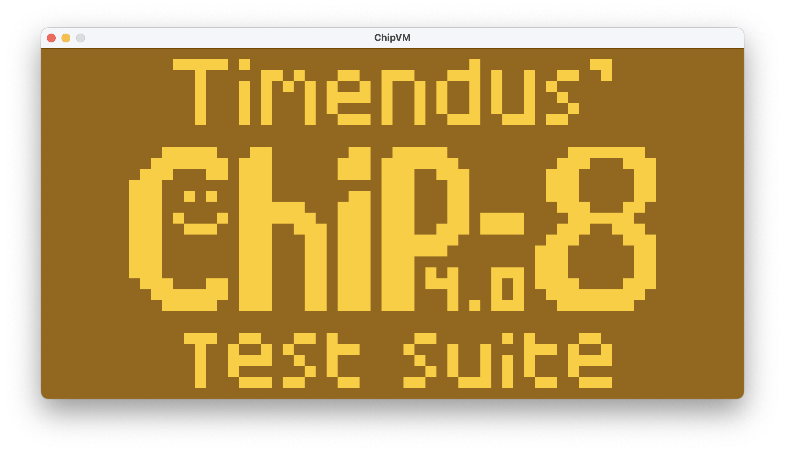
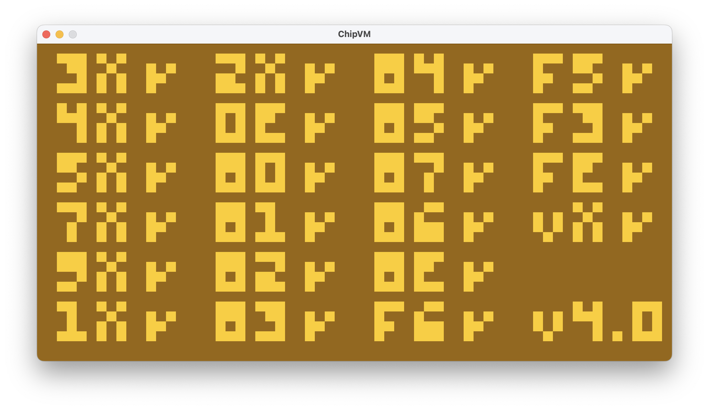
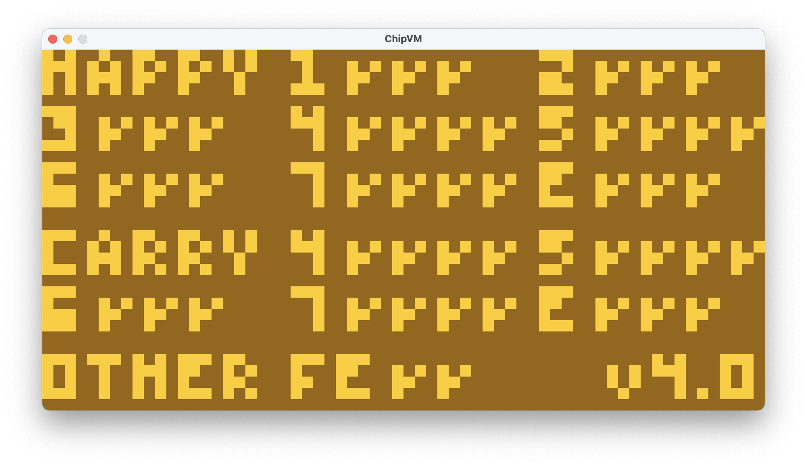
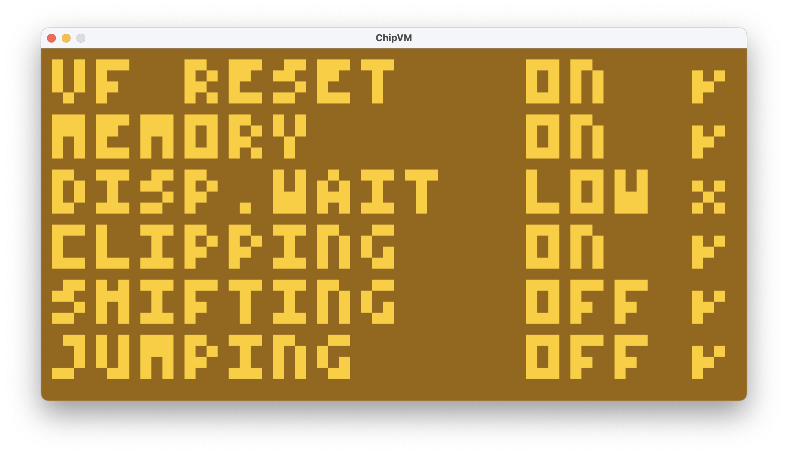
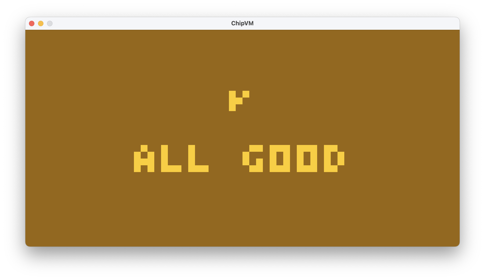

# CHIP-8 Interpreter



## Introduction
A **CHIP-8 interpreter** written in Scala, using the Processing library for graphics.

Some context on CHIP-8:

> CHIP-8 is a simple, interpreted, programming language which was first used on some do-it-yourself computer systems in the late 1970s and early 1980s. The COSMAC VIP, DREAM 6800, and ETI 660 computers are a few examples. These computers typically were designed to use a television as a display, had between 1 and 4K of RAM, and used a 16-key hexadecimal keypad for input. The interpreter took up only 512 bytes of memory, and programs, which were entered into the computer in hexadecimal, were even smaller.
>
> (http://devernay.free.fr/hacks/chip8/C8TECH10.HTM#1.0)

## Usage
### Run the interpreter
1. Update the `gradle.properties` file
   - Either:
     - delete it, and use Java 8
     - set it to your JAVA_HOME
   - It is currently set to my own (macOS) Java 8 installation
   - This is needed because I cannot use Java 8 as my main Java version, due to other applications needing newer versions.
2. If wanted, modify the `quirks.properties` file to a different ROM.
   - by default, it is set to `roms/3-corax+.ch8`, which is an extensive test rom
3. Run the `run` gradle task, or, as in Tetris, click on the green "play button" in `ChipVM.scala` inside of IntelliJ

I based my implementation mostly on the testing ROMs, the demo (games, etc.) roms were not tested much.

### Controls
The keypad is mapped to the following keys:
```
1234
QWER
ASDF
ZXCV
```

## ROMs
### Various Testing Roms
These are various testing roms that I found online and used to test the interpreter.
Many games might still be buggy, but this is because they might depend on specific quirks and behaviours I did not implement.

- `roms/1-chip8-logo.ch8`
  - Displays a CHIP-8 testing suite logo
- `roms/2-ibm-logo.ch8`
  - Displays the IBM logo
- `roms/3-corax+.ch8`
  - Tests many instructions
- `roms/4-flags.ch8`
  - Tests if flags are properly set (VF)
- `roms/5-quirks.ch8`
  - quirks that the test suite considers important to follow (might cause bugs in some roms)
- `roms/6-keypad.ch8`
  - tests keypad
- `roms/7-fontTest.ch8`
  - displays a character from the font set
- `roms/7-fontTest-Double.ch8`
  - displays a character twice, as to make the display clear again

### Demos
These are demos that I found online, I did not make them myself, ***nor did I test them extensively.***

- `roms/sir.ch8` - Triangle
- `roms/maze.ch8` - Randomly generated maze
- `roms/pong.ch8` - Pong
  - `1` for P1 Up
  - `Q` for P1 Down
  - `4` for P2 Up
  - `R` for P2 Down
- `roms/br8kout.ch8` - Breakout
  - `A` for Left
  - `D` for Right
- `roms/tetris.ch8` - Tetris
  - `W` for Left
  - `E` for Right
  - `Q` for Rotate
- `roms/buggy-RoShamBo.ch8` - RoShamBo/RPS
  - Known bug: Display also is a bit wonky: the indicated letters do not actually show that RPS move, and it does not always reset properly. It might rely on quirks or extended behaviours.
  - `Z` for Rock
  - `X` for Paper
  - `C` for Scissors
- `roms/war.ch8` - Press F to pay respects
  - `V` to pay respects (V is placed on the location of the original keypad's F)

## Tests
This interpreter passes pretty much all tests across corax+, flags, quirks and keypad:

### `3-corax+.ch8`


### `4-flags.ch8`


### `5-quirks.ch8`


### `6-keypad.ch8`


## Process and Notes

I implemented CHIP-8 as correctly and extensively as I could, yet limitations are still present:
- All test roms work
  - `5-quirks.ch8`: the display being "low" is the only complaint, but seemingly it is not a bug. 
- *Trying* to use Minim for sound was a horrible experience, and I was forced to remove it from my interpreter as I feared it would make it crash in unexpected ways.
  - It bugged out saying files did not exist when they did
  - The Oscillator (for custom square wave generation) was not working as well as needed: it did not turn on and off quirkly enough
    - at times, it slowed down the program to a crawl 
- Some roms are buggy (e.g. RPS), but they work well enough to demonstrate the interpreter's full functionality.
  - RPS has a bug where dual input might happen, I fear this might have to do with Processing and Java's AWT.

Note that there was **a best effort to make the interpreter immutable**.
