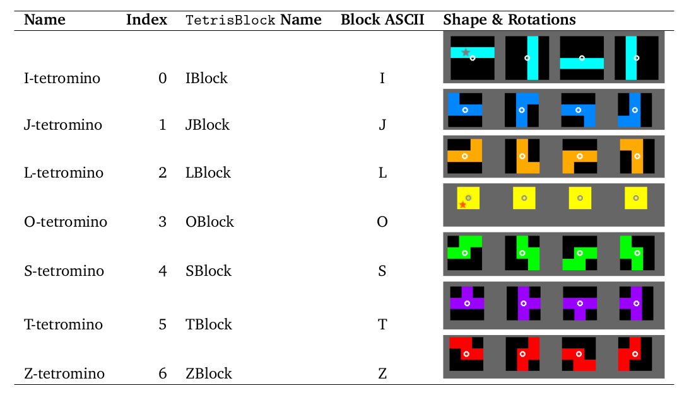

# Tetris

In the second assignment, you will implement another classic computer game, namely
Tetris. The game of Tetris centers around **tetrominoes**: geometric shapes of 4 orthogonally
connected squares. If you are not familiar with the game, you can play an official web
version [here](https://Tetris.com/play-Tetris)

You are making a slightly simplified version of this game:
* No “ghost” of where the current tetromino will end up.
* No scoring.
* No difficulty curve (speeding up).
* No hold functionality.
* No box showing the next tetrominoes.
* In the official Tetris, if a tetromino is rotated but the target spot is occupied or out of bounds, the tetromino may slightly be moved to a space that is free via a “wall-
 kick” system. We do not implement this, we simply do not rotate if the target spot is occupied or out of bounds.

The assignment is similar to assignments 2.1 and 2.3. Keep your code as simple and
readable as possible. If your implementation is more than 450 lines long (including empty lines), then something is probably wrong. The reference implementation is 170 lines long.

## Framework

The framework is highly similar to the snake framework.
Code to draw the game state and handle keyboard events has already been provided in `src/tetris/game/TetrisGame.scala`,
where you can also run the game (press the play button). You only have to implement the game logic. Your implementation
should go in `src/tetris/logic/TetrisLogic.scala` . If you want to add additional files, please make certain to
keep them in the `src.tetris.logic` package (that is the directory `src/tetris/logic`).

The drawing and event code, `TetrisGame` interacts with the game logic `TetrisLogic` as follows:

* When drawing the game, `TetrisGame` asks `TetrisLogic` for each cell in the grid what the type is. The cell types are
defined `tetris.logic.CellType` and are either `Empty` or an `<X>Cell` where X is the letter corresponding to the tetromino
that the block originated from. See below for a list of tetrominos. The drawing code
also calls `gameOver` and draws a game over text if this is true.
* When the user pressed the left, right or down arrow key, then `moveLeft`, `moveRight` or `moveDown` is called
correspondingly.
* When the user pressed the `s` key or the up arrow, then `rotateRight` is called. When the user pressed `a` then
`rotateLeft` is called.
* When the user presses the space bar, then `doHardDrop` is called. This immediately drops the current tetromino
to where it is supported by the floor or already placed blocks.
* Every 5 seconds (by default) the method `moveDown` is called to advanced the game.
You can adjust the speed of the game by increasing or decreasing the value `TetrisLogic.FramesPerSecond`.

## Test setup

The test setup is very similar to the Snake test setup. There are two main differences:
* In Snake after each test frame `Step` is called, this is not true for Tetris: only the actions that are listed for the test frame (such as Left,Right,Down,RotateRight ,etc.) are called.
* Some Tetris tests provide an initial configuration of the board.

To ensure reproducible behavior, we specify exactly how a random number generator
must be used to generate random tetrominoes. Similar to snake, a random number
generator is passed to the TetrisLogic class as an argument called `randomGen`. You should
call `randomInt(nrTetrominoes)` , where `nrTetrominoes=7` , to determine the index of
the tetromino to get.

The tetrominoes should be placed based on their anchor, which is located:
* at the center of rotation (shown as a circle in above) for tetrominoes J, L, S, T and Z.
* at the star for tetrominoes I and O.

The initial position of the anchor of the tetromino is on the second row, in the middle
column (rounded down to the left in case of an even number of columns). The initial
orientation of the tetromino is the leftmost orientation in the table above.

## Rotation and anchors

For this exercise, you have to implement how the pieces are anchored and how they rotate as shown in the
table above. You are allowed to hard-code this, but this gives fewer points than doing it in a more elegant way.

You can represent a tetromino as a set of four points relative to the center of rotation/anchor. For
example the J-tetromino is then `(-1,-1),(-1,0),(0,0),(1,0)` (y-axis increases downwards).
Rotating clockwise by 90-degree angles means that each point `(x,y)`, becomes `(-y,x)`.
For example, the 90-degree rotated form of the J-tetromino is then `(1,-1),(0,-1),(0,0),(0,1)`
Rotating counter-clockwise by 90-degree angles means that each point `(x,y)` becomes `(y,-x)`.

This works nicely, except for the O and I tetrominoes. For the O tetromino, it is easiest to simply
implement rotation by doing nothing.

For the I tetromino, one way is to implement the tetromino as a set of four points relative to the center of anchor (star in the picture), not relative to the
center of rotation (circle in the picture). The positions are then `(-1,0),(0,0),(1,0),(2,0)`.
Rotating clockwise as described above (`(x,y) -> (-y,x)`) works, but the tetromino always ends up one position to the
left of where it should be (i.e. `(0,-1),(0,0),(0,1),(0,2)`). We can fix this by pushing the tetromino one to the right after rotation.
In other words, we do `(x,y) -> (-y + 1,x)`.
Rotating counter-clockwise works by rotating around the anchor and then pushing one position to the down,
`(x,y) -> (y ,-x + 1)`.

Hence, there are three rotation behaviors:
* Rotation for pieces where the anchor=the center of rotation (`(x,y) -> (-y,x)`) (J,L,S,T,Z)
* Rotation is of the O-tetromino (rotation is a no-op)
* Rotation of the I-tetromino (`(x,y) -> (-y + 1,x)`)

To get full points, make an abstract class `Tetromino` with abstract functions `rotateLeft` and `rotateRight`.
This class should have three subclasses, each implementing a different rotation behavior.

## Assignments

There are 2 assignments for tetris:
### 3.1 Basic Tetris

Implement the basics of tetris: piece rotation and movement.
This assignment is pass/fail. To pass this assignment, you need to pass 17 tests from `TetrisTestSuite3_1`.

### 3.2 Tetris

Implement full tetris. Tests can be found in `TetrisTestSuite3_2`

Grading is built up as follows:

* Amount of tests passed: 5.5 points
* Use of _immutable_ gamestate: 1.0 points (see below)
* Meaningful usage of higher order functions (0.75 points)
    - Meaningful usage of `map` 0.25 points. NOTE: This means the map higher order _function_, Not the Map datastructure. No point will be given for using the map datastructure instead of the higher order function. 
    - Meaningful usage of `filter` 0.25 points
    - Meaningful usage of `exists` or `forall` 0.25 points
* Implementation of rotation and anchors (see table above) (max 0.75 points):
   - Hard coding is allowed, but gives 0.0 points
   - Not hard coded, but does not use subclassing (described above) (0.4 points)
   - Implement tetrominos by using subclasses (see above) (0.75 points)
* Code style 2 points

Total : 10 points

 In contrast to snake, no points are subtracted for using a 2 dimesional structure, and using such a structure is encouraged.

These rewards  are inteded to reward trying out new styles
of programming.

An example of an immutable game state can be found in the [Sokoban example](https://gitlab.com/vu-oofp/gamebase/-/tree/sokoban)
in the [immutable sokoban logic class](https://gitlab.com/vu-oofp/gamebase/-/blob/sokoban/src/main/sokoban/logic/SokobanLogic.scala).
To get the full 1.0 point, you need to:
* Not use mutable containers (Arrays and others)
* Use a GameState that contains only vals
* Use a var only to keep track of the current gamestate
CHANGE FROM SNAKE: You are NOT allowed to locally use vars and builders inside functions to get the immutability bonus. 

 Code style is judged as described in the readable code lectures and the
[code style grading guideline](https://canvas.vu.nl/courses/50305/pages/code-style).

